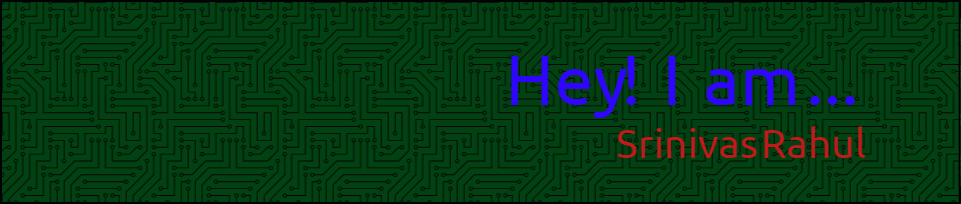

# :man_technologist: Sapireddy Srinivas Rahul GitHub Profile  



<!--📏LINE-->
<p align="center">


<h1 align="center">
  <a href="https://git.io/typing-svg">
    
  </a>
</h1>

<h5 align="center">
  <code><a href="https://www.linkedin.com/in/srsapireddy2020/" title="LinkedIn Profile"> LinkedIn</a></code>
</h5>
<br>

<!--🖼️SVG BANNER / 🌐WEBSITE: https://github.com/Akshay090/svg-banners -->
<p align="center">


<!--🔳TERMINAL / 🌐WEBSITES: https://github.com/asciinema/asciinema & https://github.com/dstein64/gifcast -->
<p align="center">


Hi, I'm Srinivas Rahul, a passionate, self-taught data science engineer and a freelance software engineer from India. My passion for software lies in dreaming up ideas and making them come true with elegant interfaces. I care greatly about the experience, architecture, and code quality of the things I build.

I am also an open-source enthusiast and maintainer. I learned a lot from the open-source community, and I love how collaboration and knowledge sharing happened through open-source.


  
  
- 💼 any freelance work? do reach, [email](mailto:sapireddysrinivas2020@gmail.com) :)
- 💬 ask me about anything, I am happy to help;

📊 **This week, I spent my time on:**
<!--START_SECTION:waka-->

```txt
Deep Learning     	6 hrs 35 mins   ████████████████████░░░░░   80.37 %
Bash              	25 mins         █▒░░░░░░░░░░░░░░░░░░░░░░░   05.25 %
Git Config        	22 mins         █░░░░░░░░░░░░░░░░░░░░░░░░   04.64 %
Data Structures         22 mins         █░░░░░░░░░░░░░░░░░░░░░░░░   04.51 %
Statistical Learning    20 mins         █░░░░░░░░░░░░░░░░░░░░░░░░   04.23 %
```

<!--END_SECTION:waka-->


If you like what I do, maybe consider buying me a coffee/tea 🥺👉👈

<a href="https://www.buymeacoffee.com/sapireddy" target="_blank"></a>


<!--📏LINE-->
<p align="center">


<p align="center">
  
</p>

<p align="center">
  
</p>


<!--📏LINE-->
<p align="center">


<h3 align="left">Languages and Tools:</h3>
<p align="left"> <a href="https://angular.io" target="_blank" rel="noreferrer">  </a> <a href="https://www.arduino.cc/" target="_blank" rel="noreferrer">  </a> <a href="https://aws.amazon.com" target="_blank" rel="noreferrer">  </a> <a href="https://www.gnu.org/software/bash/" target="_blank" rel="noreferrer">  </a> <a href="https://www.w3schools.com/css/" target="_blank" rel="noreferrer">  </a> <a href="https://www.djangoproject.com/" target="_blank" rel="noreferrer">  </a> <a href="https://www.docker.com/" target="_blank" rel="noreferrer">  </a> <a href="https://expressjs.com" target="_blank" rel="noreferrer">  </a> <a href="https://www.figma.com/" target="_blank" rel="noreferrer">  </a> <a href="https://flask.palletsprojects.com/" target="_blank" rel="noreferrer">  </a> <a href="https://git-scm.com/" target="_blank" rel="noreferrer">  </a> <a href="https://hadoop.apache.org/" target="_blank" rel="noreferrer">  </a> <a href="https://heroku.com" target="_blank" rel="noreferrer">  </a> <a href="https://hive.apache.org/" target="_blank" rel="noreferrer">  </a> <a href="https://www.w3.org/html/" target="_blank" rel="noreferrer">  </a> <a href="https://jekyllrb.com/" target="_blank" rel="noreferrer">  </a> <a href="https://www.jenkins.io" target="_blank" rel="noreferrer">  </a> <a href="https://kubernetes.io" target="_blank" rel="noreferrer">  </a> <a href="https://www.linux.org/" target="_blank" rel="noreferrer">  </a> <a href="https://www.mongodb.com/" target="_blank" rel="noreferrer">  </a> <a href="https://www.microsoft.com/en-us/sql-server" target="_blank" rel="noreferrer">  </a> <a href="https://www.mysql.com/" target="_blank" rel="noreferrer">  </a> <a href="https://www.nginx.com" target="_blank" rel="noreferrer">  </a> <a href="https://nodejs.org" target="_blank" rel="noreferrer">  </a> <a href="https://opencv.org/" target="_blank" rel="noreferrer">  </a> <a href="https://pandas.pydata.org/" target="_blank" rel="noreferrer">  </a> <a href="https://postman.com" target="_blank" rel="noreferrer">  </a> <a href="https://www.python.org" target="_blank" rel="noreferrer">  </a> <a href="https://pytorch.org/" target="_blank" rel="noreferrer">  </a> <a href="https://seaborn.pydata.org/" target="_blank" rel="noreferrer">  </a> <a href="https://www.tensorflow.org" target="_blank" rel="noreferrer">  </a> </p>

<!--📏LINE-->
<p align="center">


<h3 align="left">Blogs posts:</h3>
<!-- BLOG-POST-LIST:START -->
<!-- BLOG-POST-LIST:END -->

<h3 align="left">Connect with me:</h3>
<p align="left">
	<a href="https://medium.com/@srsapireddy" target="blank"></a> 
</p>

<!--📏LINE-->
<p align="center">


<h3 align="left">Experience:</h3>

[](https://www.thesmartbridge.com/)

**Artificial Intelligence Developer Intern** \
[**TheSmartBridge**](https://github.com/srsapireddy/srsapireddy/blob/master/SmartInternz%20-%20Certificate.pdf) • Remote <br/><br/>
<br/>
<br/>


[](https://www.uis.edu/dining)

**Graduate Student Assistant: Dining Services** \
[**UIS**](https://www.uis.edu/dining) • Part-Time <br/><br/>
<br/>
<br/>

[](https://www.umkc.edu/is/)

**Student Assistant - Technical Level II: Information Technology Services** \
[**UMKC**](https://www.umkc.edu/is//) • Part-Time \
<br/>
<br/>

<!--📏LINE-->
<p align="center">

<h3 align="left">Education:</h3>

[](https://nielit.gov.in/)

**National Institute of Electronics and Information Technology (NIELIT)** \
[**NIELIT**](https://nielit.gov.in/) • Artificial Intelligence \
Degree: Advanced Diploma (January 2020) \
<br/>
<br/>

[](https://www.uis.edu/)

**University of Illinois at Springfield (UIS)** \
[**UIS**](https://www.uis.edu/) • Computer Science \
Degree: Master of Science (December 2018)  <br/>
<br/>
<br/>

[](https://www.umkc.edu/)

**University of Missouri Kansas City (UMKC)** \
[**UMKC**](https://www.umkc.edu/) • Electrical Engineering \
Degree: Master of Science (December 2016)  <br/>
<br/>
<br/>

[](https://www.griet.ac.in/)

**Gokaraju Rangaraju Institute of Engineering and Technology (GRIET)** \
[**GRIET**](https://www.griet.ac.in/) • Electronics and Communication Engineering \
Degree: Bachelor of Technology (April 2014) \
<br/>
<br/>

<!--📏LINE-->
<p align="center">


<h3 align="left">University Involvement</h3>

[](https://mspe.org/)

**Member: Missouri Society of Professional Engineers - Western Chapter** \
[**NSPE**](https://mspe.org/) \
</br>

<br/>
<br/>


[](https://kcroonews.com/tag/sga/)

**SSE - Senator: UMKC Student Government Association** \
[**UMKC SGA**](https://kcroonews.com/tag/sga/) \
Re-elected as Senator for the School of Science and Engineering for the term 2024-2025. \
Election Results: </br>

<br/>
<br/>

<!--📏LINE-->
<p align="center">


**ASIC Physical Design Course Class Picture: Fall 2023, my first class as an instructor** </br>


<!--📏LINE-->
<p align="center">

<h3 align="left">Organizations:</h3>

[](https://hkn.ieee.org/) <br/>

**Eta Kappa Nu** \
[**Eta Kappa Nu**](https://hkn.ieee.org/) • Eta Kappa Nu is the Honor Society in Electrical and Computer Engineering. <br><br/>
<br/>

<br/>
<br/>

[](https://www.ieee.org/)

**IEEE** \
[**IEEE**](https://www.ieee.org/) • IEEE  is the world's leading professional association for advancing technology. \
Membership Number: 93943359
<br/>
<br/>

<!--📏LINE-->
<p align="center">

<h3 align="left">Professional Badges:</h3>

[](https://www.credly.com/badges/20f4bad4-2418-4696-b352-739b142f4c7c/public_url) </br>

**Cadence RTL-to-GDSII Flow v5.0** \
[**Cadence Professional Badge**](https://github.com/srsapireddy/srsapireddy/edit/master/README.md) </br>
<br>

[](https://www.credly.com/badges/181db7c0-0656-4119-abdc-73940b11fedc/public_url) </br>

**Intel Solution Pro Cloud Business Professional** \
[**Intel Professional Badge**](https://www.credly.com/badges/181db7c0-0656-4119-abdc-73940b11fedc/public_url) </br>
</br>
• Intel Cloud Business Professional badge earners have a demonstrated ability to assess an organization’s enterprise needs. They can guide customers to practical cloud solutions based on their knowledge of workload placement strategies, cloud architecture, and service offerings. <br/>
<br>

<br/>

[](https://www.credly.com/earner/earned/badge/1aeb2d54-1932-49db-bc63-b4efaef5a681) </br>

**Network Security Associate** \
[**NSE Professional Badge**](https://www.credly.com/earner/earned/badge/1aeb2d54-1932-49db-bc63-b4efaef5a681) </br>
</br>
• The Introduction to the Threat Landscape 1.0 badge recognizes a fundamental understanding of the cyber threat landscape. The badge earner has demonstrated essential knowledge of the threats that endanger computer networks, the cast of bad actors who are behind cyber threats, and the cyber security principles that can keep users and computer networks safe. <br/>
<br>

<br/>
<br/>

<!--📏LINE-->
<p align="center">

<h3 align="left">Certifications:</h3>

[](https://online.stanford.edu/courses/sohs-ystatslearning-statistical-learning) </br>

**Statistical Learning: Stanford University** \
[**Statistical Learning**](https://online.stanford.edu/courses/sohs-ystatslearning-statistical-learning) </br>
</br>
• This is an intermediate-level course in supervised learning, focusing on regression and classification methods. The syllabus includes linear and polynomial regression, logistic regression and linear discriminant analysis; cross-validation and the bootstrap, model selection, and regularization methods (ridge and lasso); nonlinear models, splines and generalized additive models; tree-based methods, random forests and boosting; support-vector machines. Some unsupervised learning methods are discussed: principal components and clustering (k-means and hierarchical). <br/>
<br>

<br/>
<br/>

[](https://www.coursera.org/specializations/mlops-machine-learning-duke) </br>

**MLOps | Machine Learning Operations Specialization** \
[**MLOps**](https://www.coursera.org/specializations/mlops-machine-learning-duke) </br>
</br>
• This comprehensive course series is perfect for individuals with programming knowledge, such as software developers, data scientists, and researchers. You'll acquire critical MLOps skills, including using Python and Rust, utilizing GitHub Copilot to enhance productivity, and leveraging platforms like Amazon SageMaker, Azure ML, and MLflow. You'll also learn how to fine-tune Large Language Models (LLMs) using Hugging Face and understand the deployment of sustainable and efficient binary, embedded models in the ONNX format, setting you up for success in the ever-evolving field of MLOps. <br>
</br>
**Courses in the specialization**
1. Python Essentials for MLOps </br>
2. DevOps, DataOps, MLOps </br>
3. MLOps Platforms: Amazon SageMaker and Azure ML </br>
4. MLOps Tools: MLflow and Hugging Face </br>


<br/>
<br/>

[](https://learn.ciieducation.in/) </br>

**CII Certified Product Management Program: Confederation of Indian Industry** \
[**CII**](https://learn.ciieducation.in/) </br>
</br>
• Modules: Product Management, Product Design & User Experience, Product Design & Modelling, Agile Project Management, Product Marketing, Product Analysis, and Technical Product Management. <br/> 
</br>


<br/>
<br/>

[](https://www.coursera.org/specializations/mathematics-machine-learning) </br>

**Mathematics for Machine Learning Specialization: Imperial College London** \
[**ICL**](https://www.coursera.org/specializations/mathematics-machine-learning) </br>
</br>
• For a lot of higher-level courses in Machine Learning and Data Science, you find you need to freshen up on the basics in mathematics - stuff you may have studied before in school or university, but which was taught in another context or not very intuitively, such that you struggle to relate it to how it’s used in Computer Science. This specialization aims to bridge that gap, getting you up to speed in the underlying mathematics, building an intuitive understanding, and relating it to Machine Learning and Data Science. <br/>
**Courses in the specialization**
1. Mathematics for Machine Learning: Linear Algebra </br>
2. Mathematics for Machine Learning: Multivariate Calculus </br>
3. Mathematics for Machine Learning: PCA </br>

[**LINK**](https://coursera.org/share/c31ef159e4ed33b85430194a24d12ced) </br>
 <br/>


[](https://iitgoa.ac.in/aishikshaai/) </br>

**Applied Accelerated Artificial Intelligence: C-DAC and National Supercomputing Mission** \
[**CDAC**](https://iitgoa.ac.in/aishikshaai/) </br>
</br>
• This course will cover the fundamentals of computing capabilities and the system software required to implement artificial intelligence (AI) based solutions on industrial use cases such as those in healthcare and Smart Cities. The course will discuss end-to-end deployments of two industrial use cases with demonstration. It will help participants use state-of-the-art AI SDKs effectively to solve complex problems. <br/>
</br>


<br/>
<br/>

[](https://iitgoa.ac.in/aishikshaai/) </br>

**Hardware Security: University of Maryland** \
[**Hardware Security**](https://www.coursera.org/learn/hardware-security) </br>
</br>
• In this course, we will study security and trust from the hardware perspective. Upon completing the course, students will understand the vulnerabilities in current digital system design flow and the physical attacks on these systems. They will learn that security starts from hardware design and be familiar with the tools and skills to build secure and trusted hardware. <br/>
<br>

<br/>
<br/>

[](https://www.coursera.org/specializations/intel-cloud-business-pro-v1) </br>

**Cloud Business Professional Specialization: INTEL** \
[**INTEL**](https://www.coursera.org/specializations/intel-cloud-business-pro-v1) </br>
</br>
• Understanding the business aspects of the cloud is key for any organization using it as the backbone for their products and services. Take your cloud acumen to the next level to sell better and address cloud-related issues. This in-depth curriculum covers various relevant topics for any seasoned cloud professional, including
assessing an organization's enterprise needs and guiding customers to practical solutions. Learn the intricacies and importance of critical topics, including workload placement strategies, cloud architecture offerings, cloud financial operations, and pricing information. <br/>

**Courses in the specialization**
1. Enterprise Business Requirements Driven Cloud <br/>
2. Business Case for Cloud Workloads <br/>
3. Cloud Pricing and Financial Operations (FinOps) <br/>


[](https://www.msicertified.com/project-management/project-management-essentials-certified/) </br>

**Project Management Essentials Certified: Management and Strategy Institute** \
[**MSI**](https://www.msicertified.com/project-management/project-management-essentials-certified/) </br>
</br>
• The Project Management Essentials Certification, designed exclusively for the Management and Strategy Institute, will give you a basic understanding of Project Management principles. <br/>

<br/>
<br/>

[](https://nielit.gov.in/sites/default/files/Chandigarh/MEA-online-4-week.pdf) </br>

**MEAN Stack Development: NIELIT** \
[**NIELIT**](https://nielit.gov.in/sites/default/files/Chandigarh/MEA-online-4-week.pdf) </br>
</br>
• Trained to use MongoDB (NoSQL) Database. Learning AngularJS as a Single Page Application development tool. Understand Server Application Development using Express. Build up skills required for developing dynamic websites. Enables collaboration of front-end developers, back-end developers, and designers.  <br/>
</br>


<br/>
<br/>

<!--📏LINE-->
<p align="center">

<h3 align="left">Hackathons:</h3>

**UMKC Hackathon 2022: Second Place Award (Entrepreneur Track)** <br/>
<br/>
 <br/>
<br/>

**UMKC Hackathon 2021: Third Place Award (CS/ IT Track)** <br/>
 <br/>
<br/>
 <br/>
<br/>


<!--📏LINE-->
<p align="center">

<h3 align="left">Other Certificates:</h3>


<!--📏LINE-->
<p align="center">

<h3 align="left">Skills:</h3>

<!--🦜PARROTSEMOJI / 🌐WEBSITE: https://github.com/seanprashad/slackmoji/ -->
<p align="center">


```js
export default () => ({
  pronouns: "He" | "Him",
  askMeAbout: [
    "Hardware Acceleration", "tech", "MLOps",
    "Deep Learning", "research"
  ],
  technologies: {
    frontEnd: {
      js: ["react", "angular"],
      css: ["bootstrap"]
    },
    backEnd: {
      js: ["node", "express"],
      python: ["flask"],
      misc: ["bash"]
    },
    machineLearning: ["tensorflow", "keras"],
    databases: ["MySQL"]
  },
  memberships: [
    "Institute of Electrical and Electronics Engineers"
  ]
});
```
<!--
#  Hello world!&nbsp;

### Education
In the overview below you will find my education:

[](https://www.kpn.com/)

**Senior Site Reliability Engineer (SRE)** \
[**KPN**](https://www.kpn.com/) • Contract \
Languages & Technologies: `RHEL`, `Python`, `Ansible`, `KSP` \
<br/>
<br/>

[](https://warpnet.nl/)

**Software Engineer (SWE) and Site Reliability Engineer (SRE)** \
[**Warpnet**](https://warpnet.nl/) • Full-time \
Languages & Technologies: `Python`, `Django`, `C++`, `JavaScript`, `GoLang`, `SaltStack`, `Prometheus` \
Featured Projects: [salt-lint](https://github.com/warpnet/salt-lint), [vscode-salt-lint](https://github.com/warpnet/vscode-salt-lint)
<br/>

[](https://duo.nl/)

**DevOps Engineer** \
[**DUO**](https://duo.nl/) • Contract \
Languages & Technologies: `Python`, `SaltStack`, `Ansible`, `RHEL`, `OpenShift` \
<br/>
<br/>
--!>
<!--📏LINE-->
<p align="center">

<p align="center">  </p>
</br>
<p align="center"> <a href="https://github.com/ryo-ma/github-profile-trophy"></a> </p>
<!--📏LINE-->
<p align="center">

- 💬 Ask me about anything and everything! </br>
- ⚡ Fun fact: I love meeting new people and eating food! </br>
- 📫 How to reach me: email me at sapireddysrinivas2020@gmail.com </br>

<div align="center">
	<br>
	
</div>

<!--📏LINE-->
<p align="center">


<h2 align="center">⚡ Stats ⚡</h2>
<br>
<p align=center>
  <div align=center>
    <a href="https://github.com/denvercoder1/github-readme-streak-stats" title="Go to Source">
      
    </a>
    <a href="https://github.com/anuraghazra/github-readme-stats" title="Go to Source">
      
    </a>
  </div>
  <br><br><br><br><br><br><br><br><br>
  <div align=center>
    <a href="https://github.com/anuraghazra/github-readme-stats">
      
    </a>
  </div>
  <br>
  
 
</p>


<!--📏LINE-->
<p align="center">


<!--📰RSS / TAKE IMAGE FROM https://github.com/trinib/trinib/blob/main/images/marquee.svg TO YOUR REPO AND EDIT IT-->
<p align="center">


<!--🎨CAPSULE / 🌐WEBSITES: https://github.com/kyechan99/capsule-render -->
<p align="center">


<!--🤖ASCIIART / 🌐WEBSITES: https://asciiart.website/ & https://github.com/github/markup/issues/1440#issuecomment-803889380 -->

<div align="center">
  
```diff
+@ @ @ @ @ @ @ @ @ @ @ @ @ @ @ @ @ @ @ @ @ @ @ @ @ @ @ @+
@@       o o                                           @@
@@       | |                                           @@
@@      _L_L_                                          @@
@@   ❮\/__-__\/❯ Programming isn't about what you know @@
@@   ❮(|~o.o~|)❯  It's about what you can figure out   @@
@@   ❮/ \`-'/ \❯                                       @@
@@     _/`U'\_                                         @@
@@    ( .   . )     .----------------------------.     @@
@@   / /     \ \    | while( ! (succed=try() ) ) |     @@
@@   \ |  ,  | /    '----------------------------'     @@
@@    \|=====|/                                        @@
@@     |_.^._|                                         @@
@@     | |"| |                                         @@
@@     ( ) ( )   Testing leads to failure              @@
@@     |_| |_|   and failure leads to understanding    @@
@@ _.-' _j L_ '-._                                     @@
@@(___.'     '.___)                                    @@
+@ @ @ @ @ @ @ @ @ @ @ @ @ @ @ @ @ @ @ @ @ @ @ @ @ @ @ @+
```
  
</div>
  
<!--🎨CAPSULE / 🌐WEBSITES: https://github.com/kyechan99/capsule-render -->
<p align="center">


<!--💬🃏FUNFACT / 🌐https://github.com/siddharth2016/quote-readme#update-your-readme -->
<p align="center">


<!--📰RSS / TAKE IMAGE FROM https://github.com/trinib/trinib/blob/main/images/marquee.svg TO YOUR REPO AND EDIT IT-->
<p align="center">


[](https://github.com/srsapireddy/github-readme-activity)


